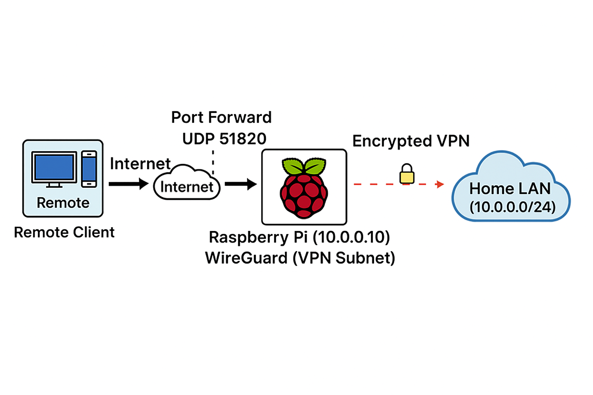
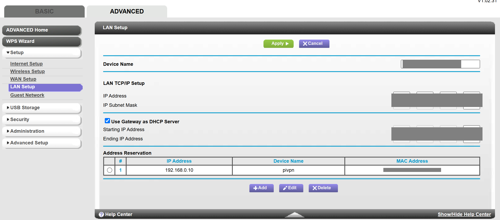
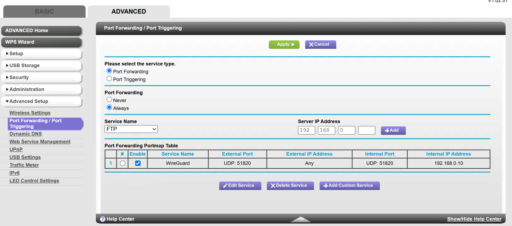

# Home VPN with Raspberry Pi 5 + WireGuard (PiVPN)

## 🌐Overview
A guide to setting up a secure home VPN using Raspberry Pi 5, WireGuard (PiVPN) with DuckDNS, UFW, and Fail2Ban, complete with setup scripts, documentation, and diagrams.

## 🗺️System Diagram

[](images/system-diagram.png)

## ⚡Quick Setup

### 1. Flash OS with Raspberry Pi Imager
- **Device**: Raspberry Pi 5
- **OS**: Raspberry Pi OS Lite (64-bit)
- **Advanced options**:
  - Hostname: pivpn (change hostname or keep default)
  - Enable SSH (key-only)
  - Username: pi (change username or keep default)
  - Password: your_password
  - (Optional) Configure Wi-Fi
- Write and verify image, then eject SD card.

### 2. Boot, connect to pi via SSH & update packages
Insert the SD card, power on the Pi, and connect via Ethernet.  
From your terminal (Windows or Git Bash):
```bash
ssh <username>@<hostname>.local
sudo apt update && sudo apt full-upgrade -y && sudo reboot
```

### 3. Secure SSH Access
Generate a key pair and disable password logins (run these **on your compter**):
```bash
ssh-keygen -t ed25519
ssh-copy-id <username>@<hostname>.local
sudo cp /etc/ssh/sshd_config /etc/ssh/sshd_config.bak
sudo nano /etc/ssh/sshd_config
# set PasswordAuthentication no
sudo systemctl restart ssh
```

### 4. Install Security Tools
```bash
sudo apt install unattended-upgrades fail2ban -y
sudo systemctl enable --now fail2ban
sudo systemctl status fail2ban --no-pager
```

### 5. Assign Static IP
**Via terminal**

Edit network configuration:
```bash
sudo nano /etc/dhcpcd.conf
```
Add:
```
interface eth0
static ip_address=192.168.0.10/24
static routers=192.168.0.1
static domain_name_servers=192.168.0.10
```
Reboot the Pi:
```bash
sudo reboot
```
**Via router**
[](images/address-reservation.png)


### 6. Install WireGuard via PiVPN & Enable NAT and Routing
```bash
curl -L https://install.pivpn.io | bash
# Choose WireGuard, port 51820/UDP, DNS of your choice, enable unattended upgrades
# Allow PiVPN to manage NAT and routing automatically when prompted
sudo systemctl status wg-quick@wg0
pivpn -d
```

### 7. Set up DuckDNS Dynamic DNS
Create an account on [duckdns.org](https://www.duckdns.org). Then:
```bash
mkdir -p ~/duckdns && cd ~/duckdns
nano duck.sh
```
Paste and update with your domain/token:
```bash
echo url="https://www.duckdns.org/update?domains=YOURDOMAIN&token=YOURTOKEN&ip=" | curl -k -o ~/duckdns/duck.log -K -
```
Make executable:
```bash
chmod 700 duck.sh
```
Open cron:
```bash
crontab -e
```
Add:
```
*/5 * * * * ~/duckdns/duck.sh >/dev/null 2>&1
```
Verify:
```bash
cat ~/duckdns/duck.log
```
Should return `ok`.  
After 5 minutes, confirm your IP at [DuckDNS Domains](https://www.duckdns.org/domains).

### 8. Router Port Forwarding
Forward UDP 51820 → 192.168.0.10:51820
[](images/port-forwarding.png)

### 9. Security Tools: UFW Firewall
```bash
sudo apt install ufw -y
sudo ufw allow 22/tcp
sudo ufw allow 51820/udp
sudo ufw enable
sudo ufw status
```

### 10. Create VPN Client Profiles (One Per Device)
Each device (phone, computer, tablet, etc.) needs its own VPN profile.  
This ensures stable connections and unique encryption keys for every client.

#### For Mobile (QR Code Method)
1. On your Raspberry Pi, create a new client:
   ```bash
   pivpn add
   ```
2. Display its QR code:
   ```bash
   pivpn -qr
   ```
3. On your phone, open the **WireGuard app** → tap **Add Tunnel → Scan from QR Code**.
4. Scan the generated QR code to import the profile.
5. Tap **Activate** to connect.


#### For Computer (Config File Method)
1. On your Raspberry Pi, create a client for your computer:
   ```bash
   pivpn add
   ```
2. Your configuration file will be saved in **/home/pi/configs/**. Transfer the config file to Windows using one of these methods:

- **Option 1** – Command Line (SCP)

  From your Windows PowerShell or Command Prompt:
  ```bash
    scp pi@pivpn.local:/home/pi/configs/client1.conf C:\Users\<your_username>\Downloads\
  ```
  *(Replace `client1.conf` with your actual filename.)*

- **Option 2** – FileZilla (Graphical SFTP)

  Install **[FileZilla Client](https://filezilla-project.org)** and open it.

  | Field | What to Enter | Example |
  |--------|----------------|----------|
  | **Host** | `sftp://<your-pi-IP>` | `sftp://192.168.0.10` |
  | **Username** | Your Pi username | `pi` |
  | **Password** | Your Pi password | (the one you set) |
  | **Port** | `22` | 22 |

  Click **Quickconnect** and accept the host key if prompted.  
  In the **right pane**, navigate to:
  ```
    /home/pi/configs/
  ```
  Drag the `.conf` file from the **right pane (Pi)** → **left pane (Windows)**.  
  The file will appear on your PC once the transfer completes.

3. Import the Config in WireGuard (Windows)
  - Open the **WireGuard app**.  
  - Click **Add Tunnel → Import Tunnel(s) from File**.  
  - Select the `.conf` file you transferred.  
  - Click **Activate** to connect.

### 11. Test and Verify VPN Connection
1. Disconnect from your home Wi-Fi.  
2. Connect to an external network (LTE or public Wi-Fi).  
3. Activate the VPN connection in the WireGuard app.  
4. Verify the tunnel:
   - On the Raspberry Pi, check active peers:
     ```bash
     sudo wg show
     ```
   - On the client device, visit [whatismyipaddress.com](https://www.whatismyipaddress.com) — it should now display your 'home network’s public IP'.

## 🛠️Troubleshooting
#### SD Card Write Error
Use Raspberry Pi Imager → *Erase* option, then re-flash the image.

#### SSH Connection Issues
If direct IP fails, use the hostname instead:
```bash
ssh username@<hostname>.local
```

#### VPN Connected but No Internet
Check UFW settings:
```bash
sudo ufw status
sudo nano /etc/default/ufw
```
Set:
```
DEFAULT_FORWARD_POLICY="ACCEPT"
```
Then reload:
```bash
sudo ufw disable && sudo ufw enable
sudo systemctl restart wg-quick@wg0
```

## 🔒Security Measures Implemented

| **Category**           | **Control** |
|-------------------------|-------------|
| **Authentication**      | SSH key-based login only |
| **Firewall**            | UFW allowing only ports `22/tcp` and `51820/udp` |
| **Intrusion Prevention**| Fail2Ban blocking SSH brute-force attempts |
| **Updates**             | Automated via Unattended Upgrades |
| **VPN**                 | Encrypted tunnels via WireGuard |
| **Dynamic DNS**         | DuckDNS script updating IP every 5 minutes |

## 📚Resources
- [Raspberry Pi Imager](https://www.raspberrypi.com/software/)
- [PiVPN Installer](https://pivpn.io)
- [WireGuard Docs](https://www.wireguard.com/)
- [DuckDNS](https://www.duckdns.org/)


---
**Last Updated:** October 2025